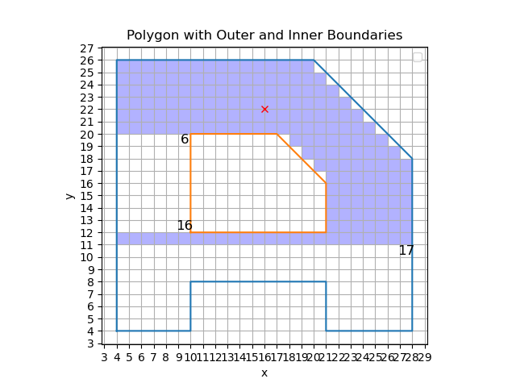
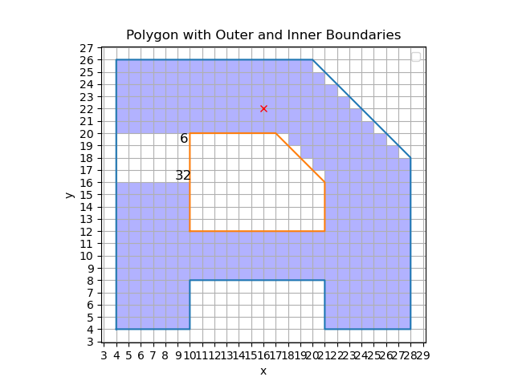

## 圆的内接正多边形逼近法改进

由于$$X_n->X_{n+1}$$需要四次矩阵乘法，考虑用递推计算。记$$P_{xi}$$为两点之间x坐标的差值：

$$P_{xi}=X_{i+1}-X_i=(\cosine a+\sin a-1)X_i\\P_{xi+1}=X_{i+2}-X_{i+1}=(\cosine a+\sin a)(\cosine a+\sin a-1)X_i=(\cosine a+\sin a)P_{xi}$$

同理可得$$P_{yi+1}=(-sina+cosa)P_{yi}$$.

因此求得初始$$P_x,P_y$$后，每次求新的$$X_i,Y_i$$只需要两次乘法和两次加法求出新的$$P_{xi+1},P_{yi+1}$$，再根据递推用两次加法求出下一个$$X_{i+1},Y_{i+1}$$,总共用到2n次乘法和4n次加法即可求出整个圆。比原始求法4n次乘法要有显著的加速。

## 中点画椭圆

由于椭圆x，y轴对称，只需要求第一象限然后对称到四个象限即可

首先，求导得斜率：
$$
\frac{2xdx}{r_x^2}+\frac{2ydy}{r_y^2}=0 \\
\frac{dx}{dy}=-\frac{2r_y^2x}{2r_x^2y},\text{临界点在  }2r_y^2x=2r_x^2y,\text{ 此时切换主导部分}
$$
主要目标是取中点，根据中点在椭圆的内外来判断下一个点取哪个

对于主导部分是x（x变的比y快）：

记$$P_k=f(x_k+1,y_k-\frac{1}{2})=r_y^2(x_k+1)^2-r_x^2(y_k-\frac{1}{2})^2-r_x^2r_y^2$$，则有两个式子。假如中点在内部，则下一个点的判别式如下：
$$
P_{k+1} = r_y^2(x_k+2)^2+r_x^2(y_k-0.5)^2-r_x^2r_y^2=P_k+r_y^2(2x_k+3)\\
\delta = r_y^2(2x_k+3)
$$
假如中点在外部，则下一个点的判别式如下:
$$
P_{k+1} = r_y^2(x_k+2)^2+r_x^2(y_k-1.5)^2-r_x^2r_y^2=P_k+r_y^2(2x_k+4)+r_x^2(-2y_k+2)\\
\delta = r_y^2(2x_k+4)+r_x^2(-2y_k+2)
$$
下半部分（y变化比x快）同理，记：
$$
P_k=f(x_k+\frac{1}{2},y_k-1)=r_y^2(x_k+\frac{1}{2})^2-r_x^2(y_k-1)^2-r_x^2r_y^2
$$
假设中点在内部，则
$$
P_{k+1}-P_k=r_x^2(2y_k+3)
$$
假设在外部，则
$$
P_{k+1}-P_k=r_x^2(2y_k+3)+r_y^2(-2x_k+2)
$$
对于起始点(0,$$r_y$$),第一个值为$$r_x^2+r_y^2(-r_x+0.25)$$

[这里](./中点椭圆.py) 是我的python实现，使用了turtle库。结果如下：

## 第四题

首先边的数据结构为（x ,$$\triangle x$$ ，ymax),排序方法是先排x，x相同排$$\triangle x$$，以此类推

0:

1:->(6,-2,3)->(6,0.5,5)

2:

3:->(2,0,6)

4:

5:->(8,-1,7)

6:->(2,4,7)

7:

接下来进行AET,从y=1开始,到指定高度自动进边，=>代表有边要被踢出

1. AET:(6,-2,3),(6,0.5,5)

2. AET:(4,-2,3),(6.5,0.5,5)
3. AET:(2,-2,3),(7,0.5,5),(2,0,3)=>(7,0.5,5),(2,0,6)
4. AET:(7.5,0.5,5),(2,0,6)
5. AET:(8,0,5),(2,0,6),(8,-1,7)=>(2,0,6),(8,-1,7)
6. AET:(2,0,6),(7,-1,7),(2,4,7)=>(7,-1,7),(2,4,7)
7. AET:(6,-1,7),(6,4,7)=>$$\empty$$ 

## 第五题

最右边是栈顶，最左边是栈底，每次画栈顶被弹出的一点，以此类推

1. stack=[(3,3)]
2. stack=[(4, 3), (2, 3), (3, 4), (3, 2)]
3. stack=[(4, 3), (2, 3), (3, 4), (4, 2), (2, 2)]
4. stack=[(4, 3), (2, 3), (3, 4), (4, 2)]
5. stack=[(4, 3), (2, 3), (3, 4), (5, 2)]
6. stack=[(4, 3), (2, 3), (3, 4), (6, 2), (5, 3)]
7. stack=[(4, 3), (2, 3), (3, 4), (6, 2), (6, 3), (5, 4)]
8. stack=[(4, 3), (2, 3), (3, 4), (6, 2), (6, 3), (4, 4)]
9. stack=[(4, 3), (2, 3), (3, 4), (6, 2), (6, 3)]
10. stack=[(4, 3), (2, 3), (3, 4), (6, 2)]
11. stack=[(4, 3), (2, 3), (3, 4)]
12. stack=[(4, 3), (2, 3), (2, 4)]
13. stack=[(4, 3), (2, 3)]
14. stack=[(4, 3)]
15. stack=[]

## 第六题

过程如下：

stack is [1, 2]

stack is [1, 3]

stack is [1, 4]

stack is [1]

stack is [5]

stack is [6, 7]

stack is [6, 8]

stack is [6, 9]

stack is [6, 10]

stack is [6, 11]

stack is [6, 12]

stack is [6, 13]

stack is [6, 14]

stack is [6, 15]

stack is [6, 16, 17]

stack is [6, 16, 18]

stack is [6, 16, 19]

stack is [6, 16, 20，21]

stack is [6, 16, 20，22]

stack is [6, 16, 20，23]

stack is [6, 16, 20，24]

stack is [6, 16,25]

stack is [6, 16,26]

stack is [6, 16,27]

stack is [6, 16,28]

stack is [6, 16]

stack is [6, 29]

stack is [6, 30]

stack is [6, 31]

stack is [6, 32]

stack is [6, 33]

stack is [6, 34]

stack is [6]

stack is []

